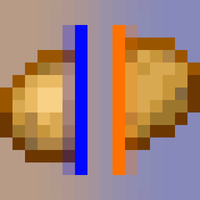

# Portal Cubed

  

  
   
  
  

Portal Cubed is a Minecraft mod for Quilt that adds mechanics from Valve's Portal series.

## Implemented Features

- All panels from Portal 1, Portal 2 [Old Aperture and New Aperture]
- Physics props like cubes, the radio, a can of beans, chairs, and more!
- Floor buttons and pedestal buttons
- Gels from Portal 2 including the cut Adhesion Gel
- Hard Light Bridges, Lasers, Excursion Funnels
- Portal Gun

## License
This project is licensed under the [MIT License](LICENSE)